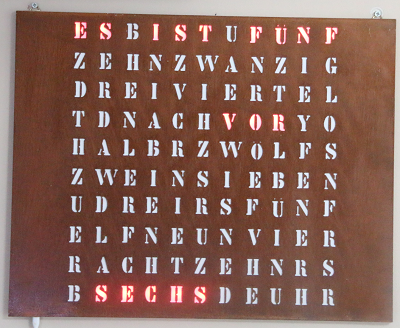

# Word clock firmware

Firmware for a ESP8266 powered word clock that drives a WS28xx strip of LEDs. So while this is primarily developed for the word clock I use it should be easy to adapt to a different layout or language of the clock.

My wife was searching for an affordable word clock for quite some time. We finally decided for a model with corten steel plate from [build-yours.de](https://build-yours.de).
The kit was good quality and not so difficult to build. I slightly changed the build by using screws for the back plate so I could get access when 
I need to fix something. This actually proved to be quite helpful.

The downside of this clock is that you do not get an open source firmware. I started with the firmware I got on the Wemos D1 mini they supplied
but after a few months the clock stopped working and I was not able to make it work again.

So I decided to do the firmware myself and also offer it to the public. 

## Features

* Connects to wifi with pre set ssid and password (Have to change it before uploading)
* Fetches time from an internet time server every 10 minutes
* Color is red by default but can be changed in code easily

The firmware currently does not support any web interface but after all it is just a clock :-)

## Wiring

The wiring is similar to the original word clock but the signal pin is RX not G4.

So you need 5V, GND, RX. Be very careful to not short circuit anything as it easily fries your ESP. Also do not connect the signal pin while uploading the firmware.

## Connect to Wifi

After uploading the sketch to your ESP8266 it will restart and try to connect to Wifi.
If it already has stored settings it will auto connect.

If not then it will open a Wifi network "Wordclock".
Connect to this network and set up your real Wifi network by pointing the browser to http://192.168.4.1 .

## Customizing

If you have a different work clock then you need to change the setup of the words (start and end LED number). This quite some work but pretty easy.

## License

The license of my code is Apache License V2. Beware though that some libraries use GPL. So if you do not replace them you have to always provide your source code changes under GPL too.

For private use this should not be any issue as you typically do not redistribute the GPL code. 
